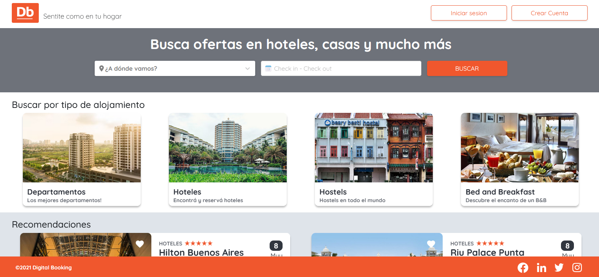

<!-- Improved compatibility of back to top link: See: https://github.com/othneildrew/Best-README-Template/pull/73 -->

<!--
*** Thanks for checking out the Best-README-Template. If you have a suggestion
*** that would make this better, please fork the repo and create a pull request
*** or simply open an issue with the tag "enhancement".
*** Don't forget to give the project a star!
*** Thanks again! Now go create something AMAZING! :D
-->

<!-- PROJECT LOGO -->
 

  

<h3 align="center">Digital Booking</h3>

  

    <a href="https://www.digitalhouse.com/ar/productos/programacion/certified-tech-developer"><strong>Certified Tech Developer</strong></a> career's final project where the knowledge of back end, front end, databases, infrastructure and testing are combined to achieve a productive cloud deployed app.
     
     
    <a href="http://0521ptc8n2-grupo6-bk-frontend.s3-website.us-east-2.amazonaws.com/"><strong>Explore the deployed app @ AWS »</strong></a>
  

<!-- TABLE OF CONTENTS -->

  
Table of Contents

  <ol>
    <li>
      <a href="#about-the-project">About The Project</a>
      <ul>
        <li><a href="#methodology">Methodology</a></li>
        <li><a href="#built-with">Built With</a></li>
      </ul>
    </li>
    <li><a href="#personal-role">Personal role</a></li>
    <li><a href="#contact">Contact</a></li>
  </ol>

<!-- ABOUT THE PROJECT -->
## About The Project

</img>

Website developed as the final project Certified Tech Developer career, created by Digital House, sponsored by MercadoLibre and Globant.

The website is a booking of accommodations where a user can create their accounts, log in, filter accomodations by category/date/city, explore the products, being able to make a reservation in one of the accomodations if wanted. On the other hand, administrators of the website can create products, modify and delete them.

We worked as a group of 5 developers using agile methodologies, the front end is 100% responsive, meeting the requirements of a prototype that was provided to us in Figma and the back end is connected by an API developed in Java. The deployment was carried out in AWS, tested with different techniques (black box & white box)

(<a href="#readme-top">back to top</a>)

## Methodology

**SCRUM** was the agile methodology chosen to work with this project, respecting the roles of Scrum Master, Product Owner, the figure of the Client and Tech Leaders. The scrum ceremonies carried out were: sprint lecture, sprint planning, dailies, weeklies, retros and sprint reviews. 

The project was divided in 4 sprints, each one having as core objective a feature: home page, products, bookings and create product page.

As a team, we used the planning poker technique to estimate the effort of the tasks asigned and to priorize those that had a greater impact on each sprint. We used boards to do the follow up of the tasks of each member. Each task was carried out in a different branch of our repositories so we could avoid major conflicts while developing the features.

(<a href="#readme-top">back to top</a>)

<!-- BUILT WITH -->
### Built With

* [![React][React.js]][React-url]
* [![Spring][Spring]][Spring-url]
* [![SASS][SASS]][SASS-url]
* [![jwt][jwt]][jwt-url]
* [![npm][npm]][npm-url]
* [![React-router][React-router]][React-router-url] 
* [![AWS][AWS]][AWS-url] 
* [![GitLab][GitLab]][GitLab-url]
* [![GitHub][GitHub]][GitHub-url]
* [![Selenium][Selenium]][Selenium-url]
* [![Jest][Jest]][Jest-url]
* [![Swagger][Swagger]][Swagger-url]
* [![Terraform][Terraform]][Terraform-url]
* [![Trello][Trello]][Trello-url]
* [![Postman][Postman]][Postman-url]
* [![VSC][VSC]][VSC-url]
* [![IntelliJ][IntelliJ]][IntelliJ-url]
* [![Hibernate][Hibernate]][Hibernate-url]
* [![MySQL][MySQL]][MySQL-url]

(<a href="#readme-top">back to top</a>)

<!-- PERSONAL ROLE -->
## Personal Role

Personally, I took the role of back end developer & database administrator, taking part of the front end development as well when needed. 

I developed the API by myself, trying to use the best practices throughout the project. The API was built using Spring framework and 3 layer arquitecture: Presentation Layer, Business Layer & Persistence Layer. Global exception handler was used, along with custom RunTime Exceptions, for error and business logic handling, as well as a custom error dictionary to facilitate error detection for back end administrators. JWT was implemented using Spring Security to restrict access to specific endpoint available only for admins (products administration, user administration, etc.)

<a href="Script DB.txt">Database creation scripte</a>

(<a href="#readme-top">back to top</a>)

<!-- CONTACT -->
## Contact

Martín Rosas - [![linkedin][linkedin-shield]][linkedin-url] - martinrosasortmann@gmail.com

Project Link: [https://github.com/github_username/repo_name](https://github.com/github_username/repo_name)

(<a href="#readme-top">back to top</a>)

<!-- MARKDOWN LINKS & IMAGES -->
<!-- https://www.markdownguide.org/basic-syntax/#reference-style-links -->
[linkedin-shield]: https://img.shields.io/badge/-LinkedIn-black.svg?style=for-the-badge&logo=linkedin&colorB=555
[linkedin-url]: https://linkedin.com/in/martinluisrosas
[product-screenshot]: images/screenshot.png
[AWS]: https://img.shields.io/badge/AWS-%23FF9900.svg?style=for-the-badge&logo=amazon-aws&logoColor=white
[AWS-url]: https://aws.amazon.com/
[GitLab]: https://img.shields.io/badge/gitlab-%23181717.svg?style=for-the-badge&logo=gitlab&logoColor=white
[GitLab-url]: https://about.gitlab.com/
[GitHub]: https://img.shields.io/badge/github-%23121011.svg?style=for-the-badge&logo=github&logoColor=white
[GitHub-url]: https://github.com/
[React.js]: https://img.shields.io/badge/React-20232A?style=for-the-badge&logo=react&logoColor=61DAFB
[React-url]: https://reactjs.org/
[React-router]: https://img.shields.io/badge/React_Router-CA4245?style=for-the-badge&logo=react-router&logoColor=white
[React-router-url]: https://reactrouter.com/en/main
[Spring]: https://img.shields.io/badge/spring-%236DB33F.svg?style=for-the-badge&logo=spring&logoColor=white
[Spring-url]: https://spring.io/
[jwt]: https://img.shields.io/badge/JWT-black?style=for-the-badge&logo=JSON%20web%20tokens
[jwt-url]: https://jwt.io/
[npm]: https://img.shields.io/badge/NPM-%23000000.svg?style=for-the-badge&logo=npm&logoColor=white
[npm-url]: https://www.npmjs.com/
[SASS]: https://img.shields.io/badge/SASS-hotpink.svg?style=for-the-badge&logo=SASS&logoColor=white
[SASS-url]: https://sass-lang.com/
[Selenium]: https://img.shields.io/badge/-selenium-%43B02A?style=for-the-badge&logo=selenium&logoColor=white
[Selenium-url]: https://www.selenium.dev/
[Jest]: https://img.shields.io/badge/-jest-%23C21325?style=for-the-badge&logo=jest&logoColor=white
[Jest-url]: https://jestjs.io/
[Swagger]: https://img.shields.io/badge/-Swagger-%23Clojure?style=for-the-badge&logo=swagger&logoColor=white
[Swagger-url]: https://swagger.io/
[Terraform]: https://img.shields.io/badge/terraform-%235835CC.svg?style=for-the-badge&logo=terraform&logoColor=white
[Terraform-url]: https://www.terraform.io/
[Trello]: https://img.shields.io/badge/Trello-%23026AA7.svg?style=for-the-badge&logo=Trello&logoColor=white
[Trello-url]: https://trello.com/
[Postman]: https://img.shields.io/badge/Postman-FF6C37?style=for-the-badge&logo=postman&logoColor=white
[Postman-url]: https://www.postman.com/
[VSC]: https://img.shields.io/badge/Visual_Studio_Code-0078D4?style=for-the-badge&logo=visual%20studio%20code&logoColor=white
[VSC-url]: https://code.visualstudio.com/
[IntelliJ]: https://img.shields.io/badge/IntelliJ_IDEA-000000.svg?style=for-the-badge&logo=intellij-idea&logoColor=white
[IntelliJ-url]: https://www.jetbrains.com/es-es/idea/
[Hibernate]: https://img.shields.io/badge/Hibernate-59666C?style=for-the-badge&logo=Hibernate&logoColor=white
[Hibernate-url]: https://hibernate.org/
[MySQL]: https://img.shields.io/badge/MySQL-00000F?style=for-the-badge&logo=mysql&logoColor=white
[MySQL-url]: https://www.mysql.com/
